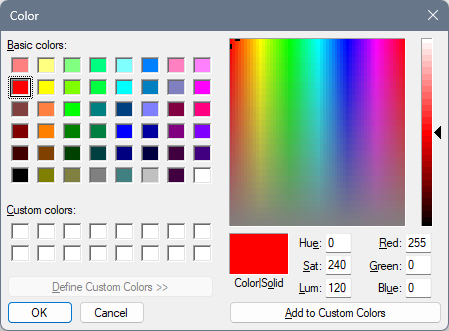
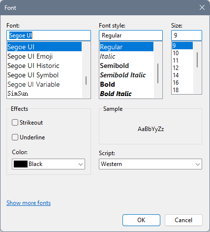
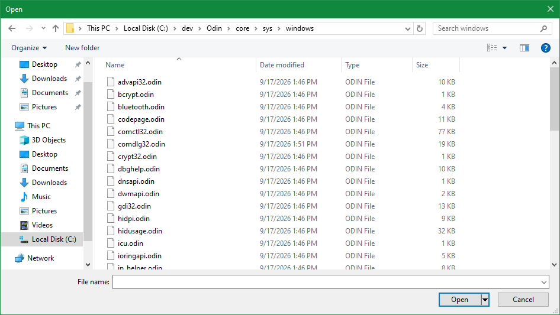
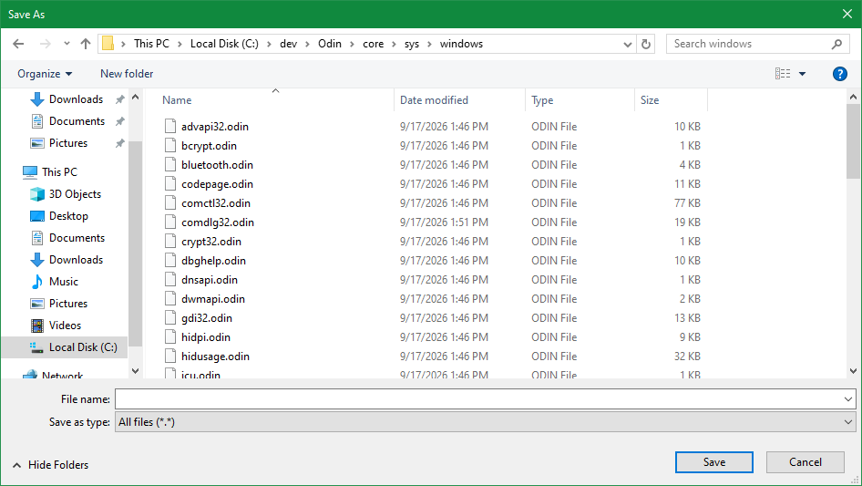
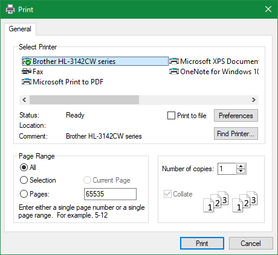
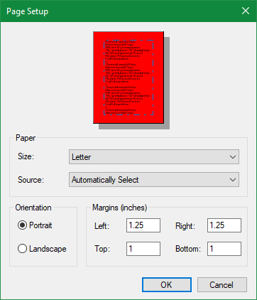
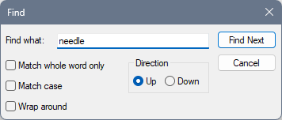
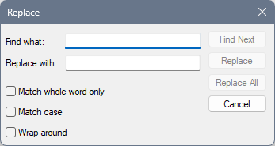

# Common dialog examples

Demonstrates the usage of the common Win32 dialog boxes in `comdlg32.dll`:

* [Color chooser](#color-chooser-dialog)
* [Font chooser](#font-chooser-dialog)
* [Open/Save file](#opensave-file-dialog)
* [Print](#print-dialog)
* [Page setup](#page-setup-dialog)
* [Find/Replace text](#findreplace-text-dialog)

See also: https://learn.microsoft.com/en-us/windows/win32/dlgbox/using-common-dialog-boxes

## Color chooser dialog

See: `color_chooser.odin`

## Font chooser dialog

See: `font_chooser.odin`

## Open/Save file dialog

See: `file_dialog.odin`

The example contains a convenience wrapper which converts to and from the Odin `string` type,
and handles construction of the file type filter string.

The example code does not implement the multi-select option.

**TODO**: Implement convenience feature for `file_dialog` with `ALLOW_MULTI_SELECT` that takes
output of the form `"path\u0000\file1u\0000file2"` and turns it into `[]string` with the path + file pre-concatenated for the user.

## Print dialog

See: `print.odin`

The print dialog examples reproduce the examples provided on MSDN without further modifications.

## Page setup dialog

See: `page_setup.odin`

The example also demonstrates how the displayed preview page can be customized.

## Find/Replace text dialog

See `find_replace_dialog.odin`

Unlike the other dialogs, this one requires additional interaction with the application's
main window.

The application is responsible for actually performing the find/replace action
in `handle_find_replace_message`.

