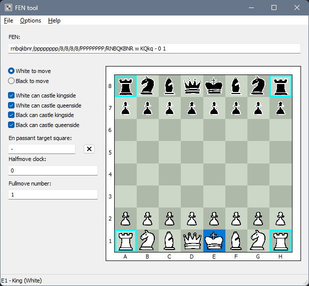
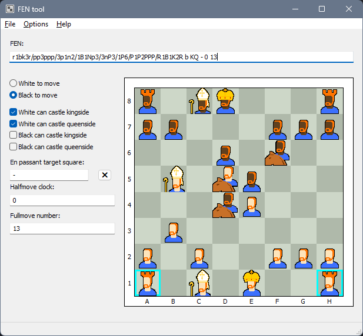

FEN tool demo project
=====================

Aims to demonstrate using Win32 embedded resources, in particular dialog templates,
in a somewhat realistic application setting.

The tool lets the user visualize and configure a chess FEN (Forsyth-Edwards Notation) string.

This application must be compiled with `-resource:resource.rc`, for example:

```
odin build . -vet -strict-style -resource:resource.rc
```

This requires the environment being set properly for Windows SDK builds. The easiest way
to get this going is to build from the *Developer Command Prompt for VS*.



Naturally, it also implements ginger mode.



Here is a rough overview of the topics covered:

 - Spinning up a message loop with a main window loaded from a dialog template.
 - Defining resource IDs (`resource.h` + `resource.odin`).
 - Instructing the resource compiler (`rc.exe`) to read the file as UTF-8.
 - Using a dialog template resource (`DIALOGEX`) containing standard system control, as
   well as user-defined controls (`CONTROL`) statement.
 - Showing simple modal dialogs from a dialog template resource (`IDD_ABOUT`).
 - Storing contextual data in `cbWndExtra` for non-dialogs (`board_control`).
 - Storing contextual data in `DWLP_USER` for dialogs.
 - Handling default dialog command IDs `IDOK` and `IDCANCEL` for `Esc` and `Enter` support.
 - Defining main menu and context menus via the resource script.
 - Loading string resources (`STRINGTABLE`) for use in user-facing messages.
 - Using an accelerator table (`ACCELERATORS`) to implement keyboard shortcuts.
 - Supporting standard keyboard navigation.
 - Using various dialog item helper functions for manipulating dialog controls, such
   as setting the text or checking/unchecking check boxes and radio buttons.
 - Declaring and implementing DPI awareness.
 - Buffered painting.
 - Playing a .wav sound from a resource.
 - Loading 24bpp Bitmaps from a resource and painting it with a transparency key.
 - Loading 32bpp PNGs from a resource and painting it with alpha blending (using `png`).
 - Setting the main window's icon and the executable's icon.
 - Showing menu item help hints in the status bar.
 - Localizing resources for different languages.

Please note that Win32 application programming as demonstrated in this example is
inherently object oriented to some degree. For example, the `board_control` aims to
be a somewhat self-contained control class.

Notes
-----

**DPI awareness**

DPI awareness is a large topic. This example relies on Windows already doing most
of the work simply by virtue of using the dialog manager functions rather than
implementing the window contents manually in code. The painting code adjusts for
DPI by where necessary by calling `adjust_for_dpi`.

Also note in general that the position and size numbers specified in dialog template
resources are "dialog units", not pixels. They can be converted with `MapDialogRect`.

**Main message loop**

If you intend to use a dialog template as the application's main window, you have
three options:

 1. Just fire it up with `DialogBox[Param]W`
 2. Create the entire dialog window with `CreateDialog[Param]W`, but implement the
    message loop manually (demonstrated in this example)
 3. Create a separate main window class, and use `CreateDialog[Param]W` only to
    create a child control that fills out the main window.

Option 1 is the easiest. It will require `EndDialog` to be called, and the system
handles the rest. However, this option does not give you control over the message
loop, in case you need to inject something there. That means, you will also not
be able to use an accelerator table.

Option 3 is the most flexible. The dialog template must have the `WS_CHILD` flag,
and it must not have a `CAPTION`. Proper sizing must be done manually. The application
must also coordinate certain events (like window closing) between the main window
procedure and the dialog window procedure.

Option 2 is a common compromise. One unfortunate flaw is that you cannot use
`CW_USEDEFAULT` upon window creation to let the system decide a good spot for
the window on the screen. This example works around this by creating an invisible
dummy window on startup just to get a suitable position. Alternatively, `DS_CENTER`
can be used to make it pop up in the center of the screen.

**Odin context propagation**

The Odin `context` gets lost when control goes through a callback chain without
the Odin calling convention, such as `WNDPROC` or `DLGPROC`.

 - `runtime.default_context()` would discard anything that the application has
   set up in `main()`, such as logging.
 - Passing a context to the window through `lpParam`/`CREATESTRUCT` into the
   `WM_CREATE` message can work sometimes, but not in general. For example, the
   board control in this application is created by the dialog manager functions.
   It is not possible to hook into this mechanism in a way that would let the
   caller pass in a contextual runtime value to specific children.
 - Using a global (or TLS "pseudo-global") is straight forward, but not across
   module boundaries. In such a case, the module containing the control would
   need to have an explicit `init` call. Additionally, memory allocated using
   the context's allocator must be freed with that same allocator. Because the
   code that captures the `context` is decoupled from the window or dialog
   procedure callback which uses the captured value, this relationship is not
   as obvious as it would normally be in Odin.

This example stores the `context` in TLS.

**String resource IDs**

String resources (declared in a `STRINGTABLE`) are grouped into blocks of 16.

When using `LoadStringW`, the actual internal resource ID is the provided ID,
divided by 16. Then, `LoadStringW` will skip over N strings, where N is the
remainder of the division.

Normally, this is not a problem, because resource IDs of different resource
types (e.g. `ICON`, `BITMAP`, `DIALOG`, etc.) do not collide with each other.
However, by convention programs use the *same* resource ID for menu items
and their corresponding help text strings. This lets the main window select
the appropriate help text automatically when a menu item is being hovered
over. In this case, it may be necessary to avoid ID conflicts.
